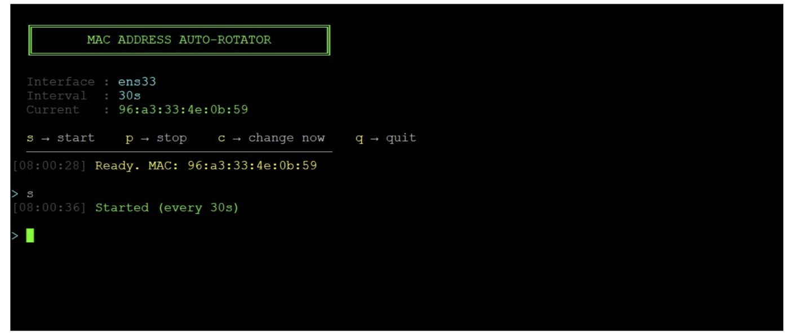

🚀 MAC Identity Rotator
Network Identity Manipulation · Privacy Testing · Behavior Simulation

  
 
  
 
  

⚡ What this is (in 3 seconds)

A lightweight CLI engine that lets you control, rotate, and simulate network identity in real time.

Built for privacy testing, detection research, and behavioral analysis — not just MAC spoofing.

🧠 Why this matters

Most systems assume one thing:
👉 a device has a stable identity.

This tool breaks that assumption.

It lets you:

simulate identity drift
test correlation mechanisms
observe tracking behavior
explore how systems react when identity is unstable
🔬 What you can actually do
🔁 Rotate MAC addresses continuously
🧪 Simulate multiple “devices” on the same interface
🧠 Test detection & tracking logic
📡 Analyze how networks react to identity changes
🕵️‍♂️ Reduce passive tracking signals
⚙️ Core capabilities
✔️ Locally Administered MAC generation (no vendor conflicts)
✔️ Real-time rotation engine (threaded)
✔️ Interactive CLI control
✔️ Dry-run mode (safe testing)
✔️ Logging system (full audit trail)
✔️ Works over SSH / headless environments
🎯 Use cases
Privacy research
Network behavior simulation
Anti-tracking testing
Detection system validation
Lab-based cybersecurity experiments
🚀 Quick start
sudo python3 mac_rotator.py

Optional:

sudo python3 mac_rotator.py --interface eth0 --interval 10
🎮 Controls
s → start rotation
p → pause
c → rotate instantly
q → quit
🧩 Environment
Linux (Debian / Ubuntu)
VM / Lab / Isolated network
SSH compatible
⚠️ Important
Requires root privileges
Intended for controlled lab environments only
Use responsibly
🧠 Bigger vision

This is not just a tool.

It’s a building block toward:

Identity-layer manipulation engines
Behavioral signal simulation
Advanced network research systems

👤 Author

Mikel
Offensive Security · Network Behavior Analysis · AI + Signal Research
